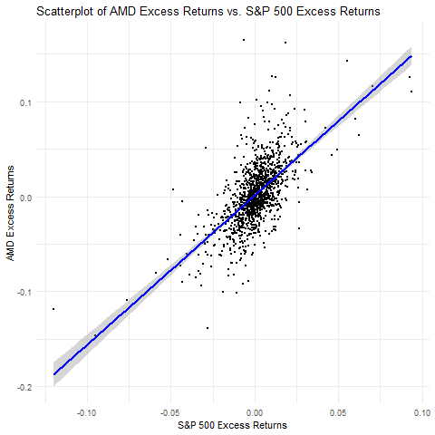

ACTL1101 Assignment Part B
================
Alan Niu
2024 T2

# CAPM Analysis

## Introduction

In this assignment, you will explore the foundational concepts of the
Capital Asset Pricing Model (CAPM) using historical data for AMD and the
S&P 500 index. This exercise is designed to provide a hands-on approach
to understanding how these models are used in financial analysis to
assess investment risks and returns.

## Background

The CAPM provides a framework to understand the relationship between
systematic risk and expected return, especially for stocks. This model
is critical for determining the theoretically appropriate required rate
of return of an asset, assisting in decisions about adding assets to a
diversified portfolio.

## Objectives

1.  **Load and Prepare Data:** Import and prepare historical price data
    for AMD and the S&P 500 to ensure it is ready for detailed analysis.
2.  **CAPM Implementation:** Focus will be placed on applying the CAPM
    to examine the relationship between AMD’s stock performance and the
    overall market as represented by the S&P 500.
3.  **Beta Estimation and Analysis:** Calculate the beta of AMD, which
    measures its volatility relative to the market, providing insights
    into its systematic risk.
4.  **Results Interpretation:** Analyze the outcomes of the CAPM
    application, discussing the implications of AMD’s beta in terms of
    investment risk and potential returns.

## Instructions

### Step 1: Data Loading

- We are using the `quantmod` package to directly load financial data
  from Yahoo Finance without the need to manually download and read from
  a CSV file.
- `quantmod` stands for “Quantitative Financial Modelling Framework”. It
  was developed to aid the quantitative trader in the development,
  testing, and deployment of statistically based trading models.
- Make sure to install the `quantmod` package by running
  `install.packages("quantmod")` in the R console before proceeding.

``` r
# Set start and end dates
start_date <- as.Date("2019-05-20")
end_date <- as.Date("2024-05-20")

# Load data for AMD, S&P 500, and the 1-month T-Bill (DTB4WK)
amd_data <- getSymbols("AMD", src = "yahoo", from = start_date, to = end_date, auto.assign = FALSE)
gspc_data <- getSymbols("^GSPC", src = "yahoo", from = start_date, to = end_date,
    auto.assign = FALSE)
rf_data <- getSymbols("DTB4WK", src = "FRED", from = start_date, to = end_date, auto.assign = FALSE)

# Convert Adjusted Closing Prices and DTB4WK to data frames
amd_df <- data.frame(Date = index(amd_data), AMD = as.numeric(Cl(amd_data)))
gspc_df <- data.frame(Date = index(gspc_data), GSPC = as.numeric(Cl(gspc_data)))

# Accessing the first column of rf_data
rf_df <- data.frame(Date = index(rf_data), RF = as.numeric(rf_data[, 1]))

# Merge the AMD, GSPC, and RF data frames on the Date column
df <- merge(amd_df, gspc_df, by = "Date")
df <- merge(df, rf_df, by = "Date")
```

#### Data Processing

``` r
colSums(is.na(df))
```

    ## Date  AMD GSPC   RF 
    ##    0    0    0    9

``` r
# Fill N/A RF data
df <- df %>%
    fill(RF, .direction = "down")
```

### Step 2: CAPM Analysis

The Capital Asset Pricing Model (CAPM) is a financial model that
describes the relationship between systematic risk and expected return
for assets, particularly stocks. It is widely used to determine a
theoretically appropriate required rate of return of an asset, to make
decisions about adding assets to a well-diversified portfolio.

#### The CAPM Formula

The formula for CAPM is given by:

$$ E(R_i) = R_f + \beta_i (E(R_m) - R_f) $$

Where:

- $E(R_i)$ is the expected return on the capital asset,
- $R_f$ is the risk-free rate,
- $\beta_i$ is the beta of the security, which represents the systematic
  risk of the security,
- $E(R_m)$ is the expected return of the market.

#### CAPM Model Daily Estimation

- **Calculate Returns**: First, we calculate the daily returns for AMD
  and the S&P 500 from their adjusted closing prices. This should be
  done by dividing the difference in prices between two consecutive days
  by the price at the beginning of the period. $$
  \text{Daily Return} = \frac{\text{Today's Price} - \text{Previous Trading Day's Price}}{\text{Previous Trading Day's Price}}
  $$

``` r
df$amd_return[1] <- 0
df$gspc_return[1] <- 0
for (i in 2:nrow(df)) {
    df$amd_return[i] <- (df$AMD[i] - df$AMD[i - 1])/df$AMD[i - 1]
    df$gspc_return[i] <- (df$GSPC[i] - df$GSPC[i - 1])/df$GSPC[i - 1]
}
```

- **Calculate Risk-Free Rate**: Calculate the daily risk-free rate by
  conversion of annual risk-free Rate. This conversion accounts for the
  compounding effect over the days of the year and is calculated using
  the formula: $$
  \text{Daily Risk-Free Rate} = \left(1 + \frac{\text{Annual Rate}}{100}\right)^{\frac{1}{360}} - 1
  $$

``` r
df$daily_rf <- ((1 + df$RF/100)^(1/360) - 1)
```

- **Calculate Excess Returns**: Compute the excess returns for AMD and
  the S&P 500 by subtracting the daily risk-free rate from their
  respective returns.

``` r
# fill the code
df$amd_excess <- df$amd_return - df$daily_rf
df$gspc_excess <- df$gspc_return - df$daily_rf
```

- **Perform Regression Analysis**: Using linear regression, we estimate
  the beta ($\beta$) of AMD relative to the S&P 500. Here, the dependent
  variable is the excess return of AMD, and the independent variable is
  the excess return of the S&P 500. Beta measures the sensitivity of the
  stock’s returns to fluctuations in the market.

``` r
model <- lm(amd_excess ~ gspc_excess, data = df)
summary(model)
```

    ## 
    ## Call:
    ## lm(formula = amd_excess ~ gspc_excess, data = df)
    ## 
    ## Residuals:
    ##       Min        1Q    Median        3Q       Max 
    ## -0.095780 -0.014728 -0.001134  0.012270  0.173633 
    ## 
    ## Coefficients:
    ##              Estimate Std. Error t value Pr(>|t|)    
    ## (Intercept) 0.0011032  0.0007237   1.524    0.128    
    ## gspc_excess 1.5700015  0.0540439  29.050   <2e-16 ***
    ## ---
    ## Signif. codes:  0 '***' 0.001 '**' 0.01 '*' 0.05 '.' 0.1 ' ' 1
    ## 
    ## Residual standard error: 0.02566 on 1257 degrees of freedom
    ## Multiple R-squared:  0.4017, Adjusted R-squared:  0.4012 
    ## F-statistic: 843.9 on 1 and 1257 DF,  p-value: < 2.2e-16

#### Interpretation

What is your $\beta$? Is AMD more volatile or less volatile than the
market?

**Answer:**

My coefficient for the excess return between AMD and S&P 500 was $\beta$
= 1.57, which indicates that AMD is generating higher excess return than
the S&P 500. Since higher return is necessarily accompanied by bearing
higher risk, we can conclude that AMD is in fact more volatile than the
S&P 500 market index.

#### Plotting the CAPM Line

Plot the scatter plot of AMD vs. S&P 500 excess returns and add the CAPM
regression line.

``` r
# Ensure columns are numeric (this step might be redundant if already handled)
df$amd_excess <- as.numeric(df$amd_excess)
df$gspc_excess <- as.numeric(df$gspc_excess)

# Plot the scatterplot with the regression line
png("capm_plot.png")
ggplot(df, aes(x = gspc_excess, y = amd_excess)) +
  geom_point(size=0.5) +                      # Scatterplot
  geom_smooth(method = "lm", col = "blue") +  # Regression line (CAPM)
  labs(title = "Scatterplot of AMD Excess Returns vs. S&P 500 Excess Returns",
       x = "S&P 500 Excess Returns",
       y = "AMD Excess Returns") +
  theme_minimal()
```

    ## `geom_smooth()` using formula = 'y ~ x'

``` r

```

<!-- -->

### Step 3: Predictions Interval

Suppose the current risk-free rate is 5.0%, and the annual expected
return for the S&P 500 is 13.3%. Determine a 90% prediction interval for
AMD’s annual expected return.

*Hint: Calculate the daily standard error of the forecast (*$s_f$), and
assume that the annual standard error for prediction is
$s_f \times \sqrt{252}$. Use the simple return average method to convert
daily stock returns to annual returns if needed.

$$ E(R_i) = R_f + \beta_i (E(R_m) - R_f) $$

**Answer:**

``` r
n <- nrow(df)

se <- summary(model)$sigma

# Forecast value Xf (mean of S&P 500 excess returns)
daily_rfr <- (1 + 5/100)^(1/360) - 1
daily_gspc_return <- 0.133/252
X_f = daily_gspc_return - daily_rfr
X_bar <- mean(df$gspc_excess)

# Calculate daily standard error of the forecast (sf)
sf <- se * sqrt(1 + (1/n) + ((X_f - X_bar)^2/sum((df$gspc_excess - X_bar)^2)))

# Convert daily standard error to annual standard error
annual_sf <- sf * sqrt(252)

# Annual expected return for AMD using CAPM
annual_expected_return_amd <- 0.05 + 1.57 * (0.133 - 0.05)

# T-critical value for 90% prediction interval
t_critical <- qt(0.95, df = n - 2)

# Calculate the prediction interval
lower_bound <- annual_expected_return_amd - t_critical * annual_sf
upper_bound <- annual_expected_return_amd + t_critical * annual_sf

# Print results
cat("90% Prediction Interval for AMD's Annual Expected Return:\n")
```

    ## 90% Prediction Interval for AMD's Annual Expected Return:

``` r
cat("Lower Bound:", lower_bound * 100, "%\n")
```

    ## Lower Bound: -49.04567 %

``` r
cat("Upper Bound:", upper_bound * 100, "%\n")
```

    ## Upper Bound: 85.10767 %

## Appendix

``` r
print(head(df))
```

    ##         Date   AMD    GSPC   RF   amd_return  gspc_return     daily_rf
    ## 1 2019-05-20 26.68 2840.23 2.35  0.000000000  0.000000000 6.452465e-05
    ## 2 2019-05-21 27.35 2864.36 2.33  0.025112446  0.008495836 6.398177e-05
    ## 3 2019-05-22 27.41 2856.27 2.32  0.002193765 -0.002824396 6.371028e-05
    ## 4 2019-05-23 26.36 2822.24 2.34 -0.038307160 -0.011914150 6.425322e-05
    ## 5 2019-05-24 26.44 2826.06 2.33  0.003034898  0.001353559 6.398177e-05
    ## 6 2019-05-28 29.05 2802.39 2.31  0.098714019 -0.008375677 6.343877e-05
    ##      amd_excess   gspc_excess
    ## 1 -6.452465e-05 -6.452465e-05
    ## 2  2.504846e-02  8.431854e-03
    ## 3  2.130054e-03 -2.888107e-03
    ## 4 -3.837141e-02 -1.197840e-02
    ## 5  2.970917e-03  1.289577e-03
    ## 6  9.865058e-02 -8.439116e-03
